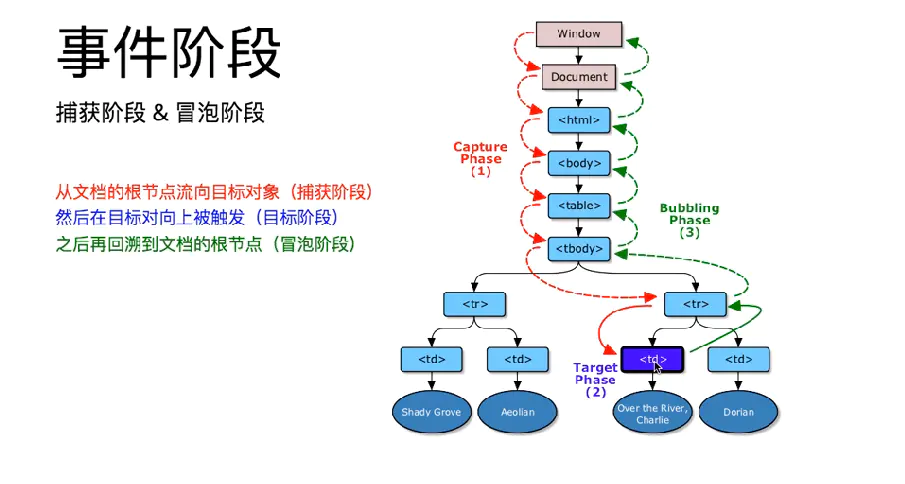

# Javascript 基础

[toc]


## js中的对象

### Object上的方法

## js中的数组

[Reference](https://mp.weixin.qq.com/s/Y_kEQstEeBh_lg5puHiLbg)

### 新建数组

```javascript
// 1. 先创建数组对象，再赋值
let temp = new Array();
temp[0] = 123;
temp[1] = "string";
temp[2] = true;
console.log(temp[0]); // 123
console.log(temp[3]); // undefined

let temp2 = new Array(2); // 规定了数组的长度为2
temp2[0] = 123;
temp2[1] = "string";
temp2[2] = true; // 虽然规定了数组长度，但仍可以再次添加元素，定义的数组大小对此没有影响

// 2. 直接实例化创建
let temp = new Array(123, "string", true);

// 3. 数组文本方式
let temp = [123, "string", true];
```

### 增删改查

-   `push `& `pop`, 都是对**数组尾部**进行**压入弹出**操作

```javascript
// push(arg1, arg2, ...)函数 可以每次压入一个或多个元素，并返回更新后的数组长度。
let temp = [123, "string", true];

let push1 = temp.push(456); // 插入一个元素
let push2 = temp.push(789, "string2", false); // 插入多个元素

// pop()函数则每次只会弹出尾部的元素，并返回弹出的元素，若对空数组调用pop()则返回undefined。会更改源数组。
let temp2 = [123];

let pop1 = temp2.pop();
console.log(pop1, temp2); // true, [];

let pop2 = temp2.pop();
console.log(pop2, temp2); // undefined, [];
```

-   队列方法 `shift `& `unshift`,  都是对**数组尾部**进行**位移与弹出**操作。

```javascript
// unshift(arg1, arg2, …)可以像数组的头部添加一个或多个元素，并返回更新后的数组长度，并把所有其他元素位移到更高的索引。
let temp = [123, 456, 789];
let unshift1 = temp.unshift("abc", "efg");
console.log(unshift1, temp); // 5, ["abc", "efg", 123, 456, 789]

// shift()方法会删除首个数组元素，并返回弹出的元素，并把所有其他元素位移到更低的索引。会更改源数组。
let temp2 = [123, 456, 789];
let shift1 = temp2.shift();
console.log(shift1, temp2); // 123, [456, 789]
```

-   **`delete` 删除数组元素**

```javascript
// JS数组属于对象，所以可以使用 JavaScript delete 运算符来删除
// 但这种方式会在数组留下未定义的空洞， 会更改源数组。
let temp = [123, 456, 789];
delete temp[1];
console.log(temp.length, temp[1]); // 3, undefined
```

-   **`splice`增删数组元素**  ---(splice拼接)
```javascript
// splice(arg1, arg2, …)
// 第一个参数定义了新添加元素的位置，第二个参数定义应删除多少元素，其余参数定义要添加的元素,并返回一个包含已删除项的数组。
// 可以在数组不留空洞的情况下删除元素。会更改源数组。

// 添加新元素，并删除已有元素
let temp1 = [1, 2, 3, 4, 5, 6];
let splice1 = temp1.splice(1, 2, 7, 8, 9);
console.log(splice1, temp1); //[2, 3],[1, 7, 8, 9, 4, 5, 6]

// 只添加新元素，不删除元素
let temp2 = [1, 2, 3, 4, 5, 6];
let splice2 = temp2.splice(1, 0, 7, 8);
console.log(splice2, temp2);//[], [1, 7, 8, 2, 3, 4, 5, 6]

// 不添加新元素，只删除元素
let temp3 = [1, 2, 3, 4, 5, 6];
let splice3 = temp3.splice(1, 2);
console.log(splice3, temp3); // [2, 3], [1, 4, 5, 6]
```

-   **`concat`合并数组**

```javascript
// 合并现有数组来创建一个新的数组
// concat(arg1, arg2, …)不会更改现有数组，总是返回一个新的数组，可以使用任意数量的数组参数
// 不会更改源数组。

let temp1 = [1, 2];
let temp2 = [3, 4];
let temp3 = [5];
let concat1 = temp1.concat(temp2, temp3);
console.log(concat1, temp1, temp2);   // [1,2,3,4,5], [1,2],[3,4]
```

-   **操作符**

```javascript
// 合并数组，不会更改源数组。
let temp1 = [1,2,3];
let temp2 = [4,5,6];
let arr = [...temp1, ...temp2];
console.log(arr); //[1,2,3,4,5,6]
```

-   **`slice`裁剪数组** ---(slice切片)

```javascript
// slice(arg1, arg2) 方法用数组的某个片段切出新数组
// 不会修改源数组中的任何元素，返回一个新数组，第一个参数为元素选取开始位置，第二个参数为元素选取结束位置，如果第二个参数被省略则会切除数组的剩余部分。[arg1, arg2)
// 不会更改源数组。

let temp = [1,2,3,4,5,6,7,8];
let slice1 = temp.slice(2, 4);
console.log(slice1, temp); //[3, 4],[1,2,3,4,5,6,7,8];

let slice2 = temp.slice(4);
console.log(slice2); //[5,6,7,8]
```

-   **`Math.max` 查数组最大值 &` Math.min` 查数组最小值**

```javascript
// Math.max.apply(arg1,arg2), Math.min.apply(arg1,arg2) 里的参数都不支持数组
//可以用Math.max.apply(null,arr)来获取数组中的最大值（Math.min.apply(null,arr)来获取数组中的最小值）

let temp = [1,3,6,2,8,4];
let _max = Math.max.apply(null, temp);
let _min = Math.min.apply(null, temp);
console.log(_max); // 8
console.log(_min); // 1
```

::: details 变量或函数名前加下划线
变量或函数名前加下划线不是js要求的，是程序员约定俗成的。通常变量前加下划线表示“私有变量”。函数名前加下划线表示“私有函数”。没特别意义，只为代码维护方便
:::


-   **查找索引**

    -   `indexOf(arg1, arg2)`方法在数组中搜索元素值并返回其位置。arg1为搜索元素，arg2可选从哪里开始搜索。负值将从结尾开始的给定位置开始，并搜索到结尾。
    -   `lastIndexOf(arg1,arg2)` 与 indexOf() 类似，但是从数组结尾开始搜索。arg2可选从哪里开始搜索。负值将从结尾开始的给定位置开始，并搜索到开头。
    -   `findIndex()` 方法返回通过测试函数的第一个数组元素的索引

```javascript
let temp = [1,35,67,8];
// 返回第一个大于10的元素索引
let findIndex1 = temp.findIndex(function(value){
    return value > 10;
})
console.log(findIndex1); //1
```

-   **查找值**

`find(function(arg1,arg2,arg3)) `方法返回通过测试函数的第一个数组元素的值。arg1为数组元素值， arg2为数组元素索引，arg3为数组本身。

```javascript
let temp = [1,35,67,8];
// 返回第一个大于10的值
let find1 = temp.find(function(value){
    return value > 10;
});
console.log(find1); //35
```


::: tip 总结
-   splice是拼接，slice是切片。
-   splice 会返回被删除元素组成的数组，或者为空数组
-   **返回被删除的元素**：pop, shift
-   **返回新数组长度**：push,unshift 
-   **改变源数组**：pop,push,shift,unshift,splice
-   **不会改变源数组**：indexOf,lastIndexOf,concat,slice 
:::


### 数组转换

-   数组转字符串

    -   `toString`

        **toString()**方法把每个元素转换为字符串，然后以逗号连接输出显示， 不会更改源数组。

    ```javascript
    let temp = [1,2,3,4];
    let toString1 = temp.toString();
    console.log(toString1, temp); // 1,2,3,4   [1,2,3,4]
    ```

    -   `join`

        join() 方法可以把数组转换为字符串，不过它可以指定分隔符。

        在调用 join() 方法时，可以传递一个参数作为分隔符来连接每个元素。

        如果省略参数，默认使用逗号作为分隔符，这时与 toString() 方法转换操作效果相同。不会更改源数组。

    ```javascript
    let temp = [1,2,3,4];
    let join1 = temp.join();
    let join2 = temp.join("*");
    console.log(join1, join2); //1,2,3,4   1*2*3*4
    ```

-   数组转对象

    -   `{...array}`

    ```javascript
    let temp = ["a","b"];
    let trans1 = {...temp};
    console.log(trans1, temp); // {0: "a", 1: "b"}, ["a","b"]
    ```

    

    -   `Object.assign(target, ...sources)`

        

    ```javascript
    let trans2 = Object.assign({}, temp); 
    // 上面的方法也可用于复制一个对象，但如果要深拷贝，需要使用其他方法
    
    console.log(trans2, temp); //{0: "a", 1: "b"}, ["a","b"]
    // 上面方法要注意temp位置，如果位置放错则不能成功转换
    let trans3 = Object.assign(temp, {});
    console.log(trans3, temp); // ["a","b"], ["a","b"]
    
    // Deep Clone 
    obj1 = { a: 0 , b: { c: 0}}; 
    let obj3 = JSON.parse(JSON.stringify(obj1)); 
    obj1.a = 4; 
    obj1.b.c = 4; 
    console.log(JSON.stringify(obj3)); // { a: 0, b: { c: 0}}
    ```

-   对象转数组

    ```javascript
    let temp = {key1: "value1", key2: "value2"};
    
    // 对象的键组成数组
    let trans1 = Object.keys(temp);
    console.log(trans1, temp); // ["key1", "key2"],  {key1: "value1", key2: "value2"}
    
    // 对象的值组成数组
    let trans2 = Object.values(temp);
    console.log(trans2); // ["value1", "value2"]
    
    // 键值对组成的数组
    let trans3 = Object.entries(temp);
    console.log(trans3); // [["key1", "key2"], ["value1", "value2"]]
    ```

-   字符串转数组

    -   `split`

    ```javascript
    // split(arg1, arg2)方法是 String 对象方法，与join()方法操作正好相反。
    // 可以指定两个参数，第一个参数为分隔符，指定从哪儿进行分隔的标记；第二个参数指定要返回数组的长度。
    let temp = "1-2-3-4-5";
    let split1 = temp.split("-");
    let split2 = temp.split("-", 2);
    console.log(split1, split2); // [1,2,3,4,5],[1,2]
    ```

> toString, join不会改变源数组


### 数组排序

-   **`sort` 数组排序**

    -   sort按照字母顺序对数组进行排序, 直接修改了源数组，所以可以不用再将返回值赋给其他变量。
-   该函数很适合字符串排序，如果数字按照字符串来排序，则 "25" 大于 "100"，因为 "2" 大于 "1"，正因如此，**sort()**方法在对数值排序时会产生不正确的结果。
    -   可以通过修正比值函数对数值进行排序。比较函数的目的是定义另一种排序顺序。比较函数应该返回一个负，零或正值，当 sort() 函数比较两个值时，会将值发送到比较函数，并根据所返回的值（负、零或正值）对这些值进行排序。会更改源数组。

    ```javascript
    let temp = ["bi", "ci", "ai", "di"];
    let sort1 = temp.sort(); // 可以不用复制给sort1, 直接执行temp.sort()这里是为方便大家直观比较
    console.log(sort1, temp); // ["ai","bi","ci","di"], ["ai","bi","ci","di"]
    
    // sort比值函数修正：降序
    let temp = [40, 100, 1, 5, 25, 10];
    temp.sort(function(a, b){
        return b-a;
    });
    console.log(temp); // [100, 40, 25, 10, 5, 1]
    
    // sort比值函数修正：升序
    let temp = [40, 100, 1, 5, 25, 10];
    temp.sort(function(a, b){
        return a-b;
    });
    console.log(temp); // [1, 5, 10, 25, 40, 100]
    ```

-   `reverse` 数组反转

    `reverse`反转数组中的元素，直接修改了源数组。

    ```javascript
    let temp = [1,3,2,4];
    temp.reverse();
    console.log(temp); // [4,2,3,1];
    ```

    

>   sort, reverse会更改源数组


### 数组迭代

对数组里的每个项进行操作

-   Array.forEach()

    **forEach(function(arg1,arg2,arg3){})** 方法为每个数组元素调用一次函数（回调函数），arg1为数组元素值， arg2为数组元素索引，arg3为数组本身. 此方法不会更改源数组，也不会创建新数组。

    ```javascript
    let temp = [1,3,5];
    temp.forEach(function(value, index, array){
        console.log(value, index, array);
    });
    /***
    *1 0 [1,3,5]
    *3 1 [1,3,5]
    *5 2 [1,3,5]
    ***/
    ```

-   Array.map()

    **map(function(arg1,arg2,arg3){})** 方法通过对每个数组元素执行函数来创建新数组，arg1为数组元素值， arg2为数组元素索引，arg3为数组本身，方法不会对没有值的数组元素执行函数. 不会更改源数组，创建一个新数组。

    ```javascript
    let temp = [1, 3, 5, , 9];
    
    //index， value不用时可以省略
    let map1 = temp.map(function(value, index, array){ 
        return value*2
    });
    console.log(map1);// [2, 6, 10, empty, 18]
    ```

-   Array.filter()

    **filter(function(arg1,arg2,arg3){})** 方法创建一个包含通过指定条件的数组元素的新数组, arg1为数组元素值， arg2为数组元素索引，arg3为数组本身，不会更改源数组。

    ```javascript
    let temp = [1, 3, 5, 7, 9];
    let filter1 = temp.filter(function(value){
        return value > 5;
    });
    console.log(filter1); // [7, 9]
    ```

-   Array.every()

    **every(function(arg1,arg2,arg3){})**方法测试数组的所有元素是否通过了置顶条件。arg1为数组元素值， arg2为数组元素索引，arg3为数组本身。不会更改源数组。

    ```javascript
    let temp = [3, 5, 7, 9];
    <!-- 检查所有元素是否都大于1 -->
    let every1 = temp.every((value) => {
        return value > 1;
    });
    console.log(every1); //true
    ```

-   Array.some()

    **some(function(arg1,arg2,arg3){})**方法测试数组中是否有元素通过了指定条件的测试。不会更改源数组。

    ```javascript
    let temp = [3, 5, 7, 9];
    <!-- 检测数组中是否包含大于6的元素 -->
    let some1 = temp.some(function(value){
        return value > 6;
    });
    console.log(some1); // true
    ```

-   Array.reduce()

    **reduce(function(arg1,arg2,arg3,arg4){})**接收一个函数作为累加器（accumulator），数组中的每个值（从左到右）开始缩减，最终为一个值。

    arg1上一次调用回调返回的值，或者是提供的初始值（initialValue）,arg2为数组元素值， arg3为数组元素索引，arg4为数组本身。不会更改源数组。

    ```javascript
    let temp = [3, 5, 7, 9];
    let reduce1 = temp.reduce(function(a,b){
        console.log(a,b);
        return a+b;
    });
    console.log(reduce1);
    /***
    *3 5
    *8 7
    *15 9
    *24
    ***/
    ```


### 跳出数组


::: tip
forEach, map, filter, every, some, reduce这些迭代方法不会改变源数组
some 在有true的时候停止
every 在有false的时候停止
:::


### 检测数组

```javascript
let temp1 = [1,2,4];
let temp2 = 5;

// instanceof 测试某个对象是否由某个指定的构造器创建
console.log(temp1 instanceof Array); // true
console.log(temp2 instanceof Array); //false

// Array.isArray 比instanceof更可靠
console.log(Array.isArray(temp1)); //true
console.log(Array.isArray(temp2)); //false

// Object对象的toString()方法，可以返回所创建对象的内部类名
console.log(Object.prototype.toString.call(temp1)); //[object Array]
console.log(Object.prototype.toString.call(temp2));// [object Number]
```


### 洗牌算法

将一个数组打乱,返回一个打乱的数组

```javascript
let temp = [1,3,5,6,7,2,4];
temp.sort(() => {
  return Math.random() - 0.5;
})
console.log(temp);
```


### 数组去重 TODO

```javascript
let temp = [1,3,5,6,7,9,4,3,1,6];

// es6的set方法
let unique1 = Array.from(new Set(temp));
console.log(unique1);//[1, 3, 5, 6, 7, 9, 4]

// es6的set方法
let unique2 = [...new Set(temp)];
console.log(unique2);//[1, 3, 5, 6, 7, 9, 4]

// 遍历数组法: 
// 先创建一个新的空数组用来存储新的去重的数组，然后遍历arr数组，在遍历过程中，分别判断newArr数组里面是不是有遍历到的arr中的元素，如果没有，直接添加进newArr中，如果已经有了（重复），那么不操作。
let newArr = [];
for(let i=0; i<temp.length;i++){
    if(newArr.indexOf(temp[i]) === -1){
        newArr.push(temp[i]);
    }
}
console.log(newArr);//[1, 3, 5, 6, 7, 9, 4]

// 数组下标判断法: 
// 如果在arr数组里面找当前的值，返回的索引等于当前的循环里面的i的话，那么证明这个值是第一次出现，所以推入到新数组里面，如果后面又遍历到了一个出现过的值，那也不会返回它的索引，indexof()方法只返回找到的第一个值的索引，所以重复的都会被pass掉，只出现一次的值都被存入新数组中。
let newArr = [];
for(let i=0; i<temp.length;i++){
    if(temp.indexOf(temp[i]) === i){
        newArr.push(temp[i]);
    }
}
console.log(newArr);//[1, 3, 5, 6, 7, 9, 4]

// 排序后相邻去除法: 
// 先用sort()方法把arr排序，那么排完序后，相同的一定是挨在一起的，把它去掉就好了。首先给新数组初始化一个arr[0]，因为我们要用它和arr数组进行比较，所以，for循环里面i也是从1开始了，我们让遍历到的arr中的值和新数组最后一位进行比较，如果相等，则pass掉，不相等的，push进来

let arr = [1,3,5,6,7,9,4,3,1,6];
arr.sort();
let newArr = [arr[0]];
for(let i=1; i<arr.length;i++){
    if(arr[i] !== newArr[newArr.length - 1]){
        newArr.push(arr[i]);
    }
}
console.log(newArr); //[1, 3, 4, 5, 6, 7, 9]

<!-- 双层for循环去重 -->
let arr = [1,3,5,6,7,9,4,3,1,6];
for(let i=0; i<arr.length;i++){
    for(let j=i+1; j<arr.length; j++){
        if(arr[i] === arr[j]){
            arr.splice(j,1);
            j--;
        }
    }
}
console.log(arr);// [1, 3, 5, 6, 7, 9, 4]
```


### 数组去非值

这里的非值指： false, 0，''， null, NaN, undefined

```javascript
let temp = [1,2,"",4,undefined,5, false,0,null,NaN];
let newArr = temp.filter((value) => {
    return value;
})
console.log(newArr); //[1,2,4,5]
```


### 用数据填充数组

```javascript
let  arr = new Array(5).fill(1);
console.log(arr);//[1,1,1,1,1]
```


### 数组中获取随机值

根据数组长度获取一个随机索引。

```javascript
let arr = ['a','b','c','d'];
let randomIndex = Math.floor(Math.random()*arr.length);
let randomValue = arr[randomIndex];
console.log(randomIndex, randomValue); // 2 c
```


## js中的遍历


### 数组遍历

1.  **Array.forEach()** 
2.  **Array.map()**

### for 普通循环遍历


1.  **for...in**

    ```javascript
    // 性能较好
    var arr = ['a', 'b', 'c', 'd'];
    for (var index in arr) {
        console.log(index, arr[index]);
    })
    // index值是字符串"0","1","2"
    ```

5.  **for...of (ES6)**

    ```javascript
    var arr = ['a', 'b', 'c', 'd'];
    for (var value of arr) {
        console.log(value);
    })
    // 只能遍历出value, 不能遍历出下标, 可遍历出Symbol数据类型的属性,此方法作为遍历所有数据结构的统一的方法
    ```


### 对象遍历

1.  **for...in**

    遍历输出的是对象自身的属性以及原型链上可枚举的属性(不含Symbol属性),原型链上的属性最后输出说明先遍历的是自身的可枚举属性,后遍历原型链上的

    ```javascript
    var obj = { 
        'name': "yayaya",
        'age': '12',
        'sex': 'female'
    };
    
    Object.prototype.pro1 = function() {}; //在原型链上添加属性
    
    Object.defineProperty(obj, 'country', {
      Enumerable: true //可枚举
    });
    
    Object.defineProperty(obj, 'nation', {
      Enumerable: false //不可枚举
    })
    
    obj.contry = 'china';
    
    for (var index in obj) {
      console.log(index, obj[index])
    }
    
    /* name yayaya
       age 12
       sex female
       contry china
       pro1 function()
    */
    ```

2.  **Object.keys()**

    遍历对象返回的是一个包含对象自身可枚举属性的数组(不含Symbol属性)

3.  **Objcet.getOwnPropertyNames()**

    输出对象自身的可枚举和不可枚举属性的数组,不输出原型链上的属性

4.  **Reflect.ownKeys()**


## this

[参考](https://segmentfault.com/a/1190000015444951) 作者： [**OBKoro1**](https://segmentfault.com/u/obkoro1)

### this 四种绑定规则

-   **默认绑定**

    -   非严格模式下，默认绑定的`this`指向全局对象。
    -   严格模式下，全局作用域中，`this`指向`window对象`。函数作用域中，`this`指向undefined

    ```javascript
    // 其中一个特殊情况
    var a = 2;
    
    function foo() {
      console.log(this.a); // foo函数不是严格模式，this默认绑定全局对象
    }
    
    function foo2(){
      "use strict";
      foo(); // 严格模式下调用其他函数，不影响其默认绑定
    }
    
    foo2(); // 输出2
    ```

-   **隐式绑定**

    -   函数在调用位置上是否有上下文对象，如果有，那么this就会隐式绑定到这个对象上。
    -   隐式绑定会丢失：
        -   函数调用时，并没有上下文对象，只是对函数的引用。
        -   情况在传入回调函数中也很常见。

    ```javascript
    var a = "global";
    
    let obj1 = {
      a: "obj1",
      obj2: obj2
    };
    
    let obj2 = {
      a: "obj2",
      foo: foo
    };
    
    function foo() {
      console.log(this.a);
    }
    
    obj2.foo(); // obj2 - this指向调用函数的对象
    obj1.obj2.foo(); // obj2 - this指向最后一层调用函数的对象
    
    // 隐式绑定丢失
    let bar = obj2.foo; // bar只是一个函数别名 是obj2.foo的一个引用
    bar(); // "global" - 指向全局
    
    // 回调函数中
    test(obj2.foo); // 传入函数的引用，调用时也是没有上下文对象。
    ```

-   **显式绑定**

    -   在某个对象上强制调用对象，通过`apply`、`call`、`bind`将函数中的`this`绑定到指定对象上。

    -   **传入的不是对象：**

        如果你传入了一个原始值(字符串,布尔类型，数字类型)，来当做this的绑定对象，这个原始值转换成它的对象形式。

        如果你把`null`或者`undefined`作为this的绑定对象传入`call`/`apply`/`bind`，这些值会在调用时被忽略，实际应用的是默认绑定规则。

    ```javascript
    let obj = {
        a: "obj"
    };
    
    function foo() {
        console.log(this.a);
    }
    
    foo.call(obj); // obj
    ```

-   **new绑定**
    -   使用构造函数的时候，this会自动绑定在new期间创建的对象上。
    -   


## setTimeout() / setInterval()

-   setTimeout / setInterval方法是挂在window对象下的。
-   setTimeout最快执行时间是4毫秒。
-   setTimeout和setInterval函数，都返回一个表示计数器编号的整数值。
-   clearTimeout()、clearInterval()清除定时器，传参为计数器的 **ID**。


### setTimeout() & setInterval()

-   setTimeout函数接受两个参数
	``` js
    是推迟执行的毫秒数var timerId = setTimeout(func|code, delay)
    // func | code 是将要推迟执行的函数名或者一段代码
    // delay 是推迟执行的毫秒数
    ```
    
-   推迟执行的代码必须以字符串的形式，放入setTimeout，因为引擎内部使用eval函数，将字符串转为代码。

-   如果**推迟执行的是函数**，则可以直接将函数名，放入setTimeout。一方面eval函数有安全顾虑，另一方面为了便于`JavaScript`引擎优化代码。


-   **`setTimeOut` 传参**

    -   在`setTimeout()`的回调函数中调用函数 

        ```javascript
        setTimeout(function(){
            要执行的函数
        }, delay)
        ```

    -   使用**bind**或**apply**方法。

        ``` javascript
        setTimeout( function(arg1){}.bind(undefined, 10), 1000 );
        // bind方法第一个参数是undefined，表示将原函数的this绑定全局作用域，第二个参数是要传入原函数的参数。它运行后会返回一个新函数，该函数不带参数。
        ```

-   **setTimeout()中回调函数中的this**
    
    -   如果被setTimeout推迟执行的回调函数是某个对象的方法，那么该方法中的this关键字将指向全局环境，而不是定义时所在的那个对象。
-   **setTimeout() 运行机制**
    -   setTimeout和setInterval的运行机制是，将指定的代码移出本次执行，等到下一轮Event Loop时，再检查是否到了指定时间。如果到了，就执行对应的代码；如果不到，就等到再下一轮Event Loop时重新判断。这意味着，setTimeout指定的代码，必须等到本次执行的所有代码都执行完，才会执行。
    -   `setTimeout(function, 0)`将function移动到任务队列尾部，其它任务完成后立即执行此任务。
    -   `setTimeout(function, 0) `可分割代码块

### clearTimeout() & clearInterval()

-   每次设置定时器，都会产生一个此定时器的ID，因此**清除所有定时器**时可将所有的定时器push到一个list里面，然后再遍历列表，依次清除。
-   例如设置发送验证码倒计时时，在外部清除定时器需要用到以上方法。


## 判断值是否为空

**如果是 `undefined`， `null`， `''`， `NaN`，`false`，`0`，`[]`，`{}` ，空白字符串，都返回true，否则返回false。**

```javascript
function isEmpty(value) {
    switch (typeof value) {
    case 'undefined':
        return true;
    case 'string':
        if (v.replace(/(^[ \t\n\r]*)|([ \t\n\r]*$)/g, '').length == 0) return true;
        break;
    case 'boolean':
        // 如果是false，也返回true
        if (!v) return true;
        break;
    case 'number':
        if (0 === v || isNaN(v)) return true;
        break;
    case 'object':
        if (null === v || v.length === 0) return true;
        for (var i in v) {
            return false;
        }
        return true;
    }
    return false;
}
```


## export

[Reference](https://developer.mozilla.org/zh-CN/docs/Web/JavaScript/Reference/Statements/export)

在创建JavaScript模块时，`export` 语句用于从模块中导出函数、对象或原始值，以便其他程序可以通过 [`import`](https://developer.mozilla.org/zh-CN/docs/Web/JavaScript/Reference/Statements/import) 语句使用它们。

无论您是否声明，导出的模块都处于[`严格模式`](https://developer.mozilla.org/zh-CN/docs/Web/JavaScript/Reference/Strict_mode)。 export语句不能用在嵌入式脚本中。


两种导出方式：

-   命名导出（每个模块包含任意数量）
-   默认导出（每个模块包含一个）


## 函数防抖（debounce）和函数节流（throttle）

[参考](https://www.jianshu.com/p/c8b86b09daf0)

在实际前端开发过程中，经常会需要绑定一些持续触发的事件，如 resize、scroll、mousemove 等等，但是在事件持续触发的过程中频繁地去执行函数会影响性能。

### 防抖（debounce）

**触发事件后在 n 秒内函数只能执行一次，如果在 n 秒内又触发了事件，则会重新计算函数执行时间。**


防抖函数分为 `非立即执行版` 和 `立即执行版`。


-   非立即执行版: 触发事件后函数不会立即执行，而是在 n 秒后执行，如果在 n 秒内又触发了事件，则会重新计算函数执行时间。

```javascript
function debounce(func, wait) {
    let timeout;
    return function () {
        let context = this;
        let args = arguments;

        if (timeout) clearTimeout(timeout);
        
        timeout = setTimeout(() => {
            func.apply(context, args)
        }, wait);
    }
}
// 需要注意的是 this 和 参数的传递
let context = this;
let args = arguments;
// 防抖函数的代码使用这两行代码来获取 this 和 参数，是为了让 debounce 函数最终返回的函数 this 指向不变以及依旧能接受到 e 参数。
```

```javascript
// onmousemove 绑定content 鼠标移动事件可以这样使用
content.onmousemove = debounce(count,1000);
```


-   立即执行版: 触发事件后函数会立即执行，然后 n 秒内不触发事件才能继续执行函数的效果。

```javascript
function debounce(func,wait) {
    let timeout;
    return function () {
        let context = this;
        let args = arguments;

        if (timeout) clearTimeout(timeout);

        let callNow = !timeout;
        timeout = setTimeout(() => {
            timeout = null;
        }, wait)

        if (callNow) func.apply(context, args)
    }
}
```


-   结合版

```javascript
/**
 * @desc 函数防抖
 * @param func 函数
 * @param wait 延迟执行毫秒数
 * @param immediate true 表示立即执行，false 表示非立即执行
 */
function debounce(func,wait,immediate) {
    let timeout;

    return function () {
        let context = this;
        let args = arguments;

        if (timeout) clearTimeout(timeout);
        if (immediate) {
            var callNow = !timeout;
            timeout = setTimeout(() => {
                timeout = null;
            }, wait)
            if (callNow) func.apply(context, args)
        }
        else {
            timeout = setTimeout(function(){
                func.apply(context, args)
            }, wait);
        }
    }
}
```


### 节流（throttle）

**连续触发事件但是在 n 秒中只执行一次函数。**节流会稀释函数的执行频率。

对于节流，一般有两种方式可以实现，分别是时间戳版和定时器版。

-   时间戳版：

```js
function throttle(func, wait) {
    let previous = 0;
    return function() {
        let now = Date.now();
        let context = this;
        let args = arguments;
        if (now - previous > wait) {
            func.apply(context, args);
            previous = now;
        }
    }
}
```


-   定时器版:

```jsx
function throttle(func, wait) {
    let timeout;
    return function() {
        let context = this;
        let args = arguments;
        if (!timeout) {
            timeout = setTimeout(() => {
                timeout = null;
                func.apply(context, args)
            }, wait)
        }

    }
}
```

在持续触发事件的过程中，函数不会立即执行，并且每 1s 执行一次，在停止触发事件后，函数还会再执行一次。

时间戳版和定时器版的节流函数的区别是，时间戳版的函数触发是在时间段内开始的时候，而定时器版的函数触发是在时间段内结束的时候。


- 结合版：

```js
/**
 * @desc 函数节流
 * @param func 函数
 * @param wait 延迟执行毫秒数
 * @param type 1 = 时间戳版，2 = 定时器版
 */
function throttle(func, wait ,type) {
    if (type===1) {
        let previous = 0;
    }else if (type===2) {
        let timeout;
    }
    return function() {
        let context = this;
        let args = arguments;
        if (type===1) {
            let now = Date.now();

            if (now - previous > wait) {
                func.apply(context, args);
                previous = now;
            }
        } else if (type===2) {
            if (!timeout) {
                timeout = setTimeout(() => {
                    timeout = null;
                    func.apply(context, args)
                }, wait)
            }
        }
    }
}
```


## 事件冒泡，事件捕获



##### （1）捕获阶段（Capture Phase）

事件的第一个阶段是捕获阶段。事件从文档的根节点流向目标对象节点。途中经过各个层次的DOM节点，并在各节点上触发捕获事件，直到到达事件的目标节点。捕获阶段的主要任务是建立传播路径，在冒泡阶段，事件会通过这个路径回溯到文档跟节点。

##### （2）目标阶段（Target Phase）

当事件到达目标节点的，事件就进入了目标阶段。事件在目标节点上被触发，然后会逆向回流，直到传播至最外层的文档节点。

##### （3）冒泡阶段（Bubble Phase）

事件在目标元素上触发后，并不在这个元素上终止。它会随着DOM树一层层向上冒泡，回溯到根节点。
 冒泡过程非常有用。它将我们从对特定元素的事件监听中释放出来，如果没有事件冒泡，我们需要监听很多不同的元素来确保捕获到想要的事件。

[参考](https://www.jianshu.com/p/8311f782f70d)


## 事件委托和事件代理

[参考](https://www.jianshu.com/p/a77d8928c5c9)

-   什么是事件委托？

    事件委托还有一个名字叫事件代理，JS高程上讲：事件委托就是利用事件冒泡，只制定一个时间处理程序，就可以管理某一类型的所有事件。

-   为什么要用事件委托

    在JavaScript中，添加到页面上的事件处理程序数量将直接关系到页面的整体运行性能，因为需要不断的与dom节点进行交互，访问dom的次数越多，引起浏览器重绘与重排的次数也就越多，就会延长整个页面的交互就绪时间，这就是性能优化的主要思想之一，减少DOM操作；每个函数都是一个对象，是对象就会占用内存，对象越多，内存占用率越大，100个li就要占用100个内存空间。如果要用事件委托，就会将所有的操作放到js程序里面，只对它的父级(如果只有一个父级)这一个对象进行操作，与dom的操作就只需要交互一次，这样就能大大的减少与dom的交互次数，提高性能；

-   事件委托的原理

    事件委托是利用事件的冒泡原理来实现的。事件冒泡就是事件从最深的节点开始，然后逐步向上传播事件。例如：最里层的层级点击事件会冒泡到最外层的层级上，然后委托最外层的父级代为处理点击事件。

