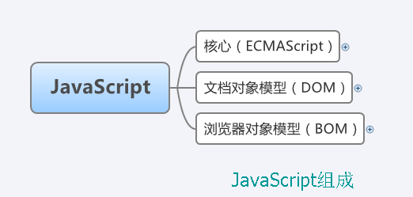

[toc]

# JavaScipt ES6


## 函数调用

1.  ```javascript
    // 直接调用
    function test() {
        // ...
    }
    
    test();
    ```

2.  ```javascript
    // 对象调用
    var obj = {
        test: function() {
            // ...
        }
    }
    
    obj.test();
    ```

3.  ```javascript
    // 构造函数调用
    // 构造函数的调用会创建一个新的对象。新对象会继承构造函数的属性和方法。
    // Tips: 构造函数中 this 关键字没有任何的值。this 的值在函数调用实例化对象(new object)时创建。
    
    var a = new test();
    ```

4.  ```javascript
    // 作为函数方法调用
    // 使用 call() 或 apply()
    
    // 在 JavaScript 严格模式(strict mode)下, 在调用函数时第一个参数会成为 this 的值， 即使该参数不是一个对象。
    // 在 JavaScript 非严格模式(non-strict mode)下, 如果第一个参数的值是 null 或 undefined, 它将使用全局对象替代。
    
    myObj = test.call(myObj);
    myObj = test.apply(myObj);
    ```


## call(), apply(), bind()

相同点：

-   都是用来重定义 ``this`` 这个对象的
-    第一个参数都是 ``this`` 的指向对象 
-    三者的参数允许是各种类型

不同点：

-   ``call()`` 和 ``bind()`` 传入的参数是用 ``逗号 , `` 分割，``apply()`` 传入的是一个参数数组，需要将参数放入数组中去
-   ``bind()`` 返回的是一个新的函数，因此要调用它需要执行


# JavaScript 浏览器对象模型



 https://www.kancloud.cn/digest/web-basic/196456 

