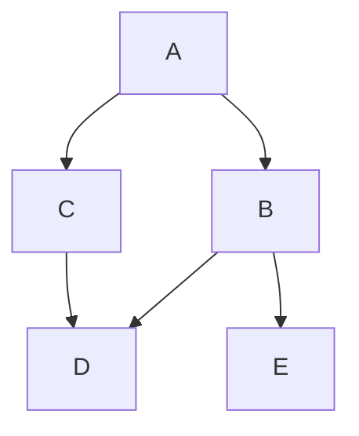
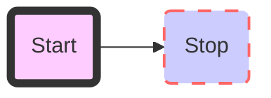

# MarkDown语法与Typora

正在学习MarkDown语法和Typora，简单记录一下，Peace~ 😊


目录[TOC]

[TOC]

## 参考

[Typora: 简单高效的Markdown编辑器 作者：毕小烦](https://www.jianshu.com/p/45ff441ac0d6)

[Markdown编辑器大对比 MacOSx 作者：不是程序](https://www.jianshu.com/p/39333840fdbf)

[如何在Markdown中画流程图 作者：lkkwxy](https://www.jianshu.com/p/b421cc723da5)

## 功能点


## 基本语法

### 文本

**粗体**

*斜体*

``标签``

~~删除线~~

<u>下划线</u>【不建议使用，有可能会和超链接混淆】

==高亮==

我是这段话的^上标^

我是这段话的~下标~

[百度](http://www.baidu.com)

> 内容块
>
> 窝窝头，一块钱四个，嘿嘿 🤭
>
> > 再来一个烤山药，要记得吃大块的哟~

Emoji表情 :+1:		:emoji:

分割线

---

转义符号：\

脚注：

需要注明的文本[^1]

[^1]: Typora很赞

分割线

***


### 设置字体

<font face="黑体">字体样式：黑体</font>
<font face="微软雅黑">字体样式：微软雅黑</font>
<font face="STCAIYUN">字体样式：华文彩云</font>
<font color = red>字体颜色：红色</font>

<font color = blue>字体颜色：蓝色</font>

<font size=6>字体尺寸：6</font>
<font face="黑体" color=green size=1>我是黑体，绿色，尺寸为1</font>

<table><tr><td bgcolor=yellow>字体背景色：yellow</td></tr></table>
按钮显示：<kbd>Ctrl</kbd>+<kbd>C</kbd> 复制


### 代码

```python
print('Hello, World')
```

```javascript
function addNum() {
    let i = 0;
    return i + 8;
};
```


### 有序列表

1. 第一项
   1. 第一小项
2. 第二项

### 无序列表

- 文本内容
- 文本内容
  - 文本内容
    - 文本内容

### 任务列表

- [ ] Finish my changes
- [ ] Push my commits to GitHub
- [x] Open a pull request


## 公式

### 行内公式

$$x^2$$

### 块间公式

$$\begin{align}
  \nabla \times \vec{\mathbf{B}} -\, \frac1c\, \frac{\partial\vec{\mathbf{E}}}{\partial t} & = \frac{4\pi}{c}\vec{\mathbf{j}} \\
  \nabla \cdot \vec{\mathbf{E}} & = 4 \pi \rho \\
\end{align}$$


## 表格

| 表格1 | 表格2 | 表格3 |
| :----- | :-----: | -----: |
|左对齐|居中|右对齐|


## 顺序图

### sequence

```sequence
Title: Here is a title
A->B: Normal line
B-->C: Dashed line
C->>D: Open arrow
D-->>A: Dashed open arrow
```


## 流程图

### flow

```flow
st=>start: Start:>http://www.google.com[blank]
e=>end:>http://www.google.com
op1=>operation: My Operation
sub1=>subroutine: My Subroutine
cond=>condition: Yes
or No?:>http://www.google.com
io=>inputoutput: catch something...

st->op1->cond
cond(yes)->io->e
cond(no)->sub1(right)->op1
```

### mermaid

- TB（或TD）从上到下
- BT 从下到上
- RL 从右到左
- LR 从左到右

```mermaid
graph TD
    id[带文本的矩形]
    id4(带文本的圆角矩形)
    id3>带文本的不对称的矩形]
    id1{带文本的菱形}
    id2((带文本的圆形))
```

```mermaid
graph LR
    A[A] --> B[B] 
    A1[A] --- B1[B] 
    A4[A] -.- B4[B] 
    A5[A] -.-> B5[B] 
    A7[A] ==> B7[B] 
    A2[A] -- 描述 --- B2[B] 
    A3[A] -- 描述 --> B3[B] 
    A6[A] -. 描述 .-> B6[B] 
    A8[A] == 描述 ==> B8[B]
```







