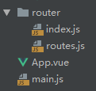

# Vue Router

Vue Router 是 [Vue.js](http://cn.vuejs.org/) 官方的路由管理器。它和 Vue.js 的核心深度集成，让构建单页面应用变得易如反掌。

[toc]

[参考](https://router.vuejs.org/zh/)

## Vue Router 模块化路由配置

### HTML

```html
<div id="app">
  <h1>Hello App!</h1>
  <p>
    <!-- 使用 router-link 组件来导航. -->
    <!-- 通过传入 `to` 属性指定链接. -->
    <!-- <router-link> 默认会被渲染成一个 `<a>` 标签 -->
    <router-link to="/child">Go to child</router-link>
    <router-link to="/bar">Go to Bar</router-link>
  </p>
  <!-- 路由出口 -->
  <!-- 路由匹配到的组件将渲染在这里 -->
  <router-view></router-view>
</div>
```


### js

1.  项目根目录下，`src` 文件夹，`router` 文件夹下，建立`routes.js` 文件。

    文件结构如下图： 

2.  `main.js` 文件

```javascript
// 项目核心文件
import Vue from 'vue'
import App from './App'

// ********* 引入router文件夹 **************
import router from './router'
// ***************************************

Vue.config.productionTip = false

/* eslint-disable no-new */
new Vue({
    el: '#app',
    // ****** 将router标识出来 *****
    router,
    // ***************************
    components: { App },
    template: '<App/>'
})
```

3.  `router` 文件夹下 `index.js` ：

```javascript
import Vue from 'vue'
import VueRouter from 'vue-router'
import routes from './routes'

Vue.use(VueRouter) // 模块化机制编程，导入Vue和VueRouter，要调用 Vue.use(VueRouter)

const router = new VueRouter({
  routes,
  mode: 'history' // H5 history模式
})

export default router
```

4.  `routes.js` 文件：

```javascript
// 引入 vue 组件
import HelloWorld from '@/components/HelloWorld'
// 示例
export default [
    {
        path: '/',
        name: 'HelloWorld',
        component: HelloWorld,
        children: [
            {
                path: '/child',
                name: 'child',
                component: () => import('@/components/child')
            }
        ]
    }
]
```


通过注入路由器，我们可以在任何组件内通过 `this.$router` 访问路由器，也可以通过 `this.$route` 访问当前路由。


## HTML5 history模式

[官方文档-H5 history模式]( https://router.vuejs.org/zh/guide/essentials/history-mode.html )

`vue-router` 默认 hash 模式 —— 使用 URL 的 hash 来模拟一个完整的 URL，于是当 URL 改变时，页面不会重新加载。

如果不想要很丑的 hash，我们可以用路由的 **history 模式**，这种模式充分利用 `history.pushState` API 来完成 URL 跳转而无须重新加载页面，而URL 就像正常的 url，例如 `http://yoursite.com/user/id`。

因为我们的应用是个单页客户端应用，所以需要后台正确的配置支持。否则容易404.

所以要在服务端增加一个覆盖所有情况的候选资源：如果 URL 匹配不到任何静态资源，则应该返回同一个 `index.html` 页面，这个页面就是 app 依赖的页面。


## 监听路由变化

```javascript
let vm = new Vue({ // 监听路由变化
    el: "#app",
    data: {},
    router,
    watch: {
        '$route.path': function (to, from) {
        // to , from 分别表示从哪跳转到哪，都是一个对象
        // to.path  ( 表示的是要跳转到的路由的地址 eg: /home );
        }
    }
})
```


## 动态路由匹配


### 动态路径参数

```javascript
const User = {
  template: '<div>User</div>'
}

const router = new VueRouter({
  routes: [
    // 动态路径参数 以冒号开头
    { path: '/user/:id', component: User }
  ]
})
// 一个“路径参数”使用冒号 : 标记。当匹配到一个路由时，参数值会被设置到 this.$route.params，可以在每个组件内使用。
const User = {
  template: '<div>User {{ $route.params.id }}</div>'
}
```


### 多段路径参数

```javascript
const router = new VueRouter({
  routes: [
    // 多段路径参数
    { path: '/user/:username/post/:post_id',
      name: 'user', // 命名路由
      component: User,
    }
  ]
});

// 编程式导航
router.push({ name: 'user', params: { username: 'Gary', post_id: '001' }});

// 最终路由导航至 '/user/Gary/post/001'
// PS: 如果提供了path而不是name，params会被忽略
```


## 编程式导航

**在 Vue 实例内部，你可以通过 `this.$router` 访问路由实例。**

>   声明式：<router-link :to="...">

#### router实例方法

>   Vue Router 的导航方法 (`push`、 `replace`、 `go`) 在各类路由模式 (`history`、 `hash` 和 `abstract`) 下表现一致。

```js
// 向 history 栈添加一个新的记录，所以，当用户点击浏览器后退按钮时，则回到之前的 URL。
router.push(location, onComplete?, onAbort?)
router.push(location).then(onComplete).catch(onAbort)

// 在 history 栈中替换掉当前的记录。
router.replace(location, onComplete?, onAbort?)
router.replace(location).then(onComplete).catch(onAbort)

// 参数是一个整数，在 history 记录中向前或者后退多少步，类似 window.history.go(n)。
// n > 0, 在浏览器记录中前进一步，等同于 history.forward()
// n < 0, 在浏览器记录中后退一步，等同于 history.back()
// 如果 history 记录不够用，就失败
router.go(n)
```

#### 关于router.push和router-link 组件的 `to` 属性

```javascript
// 字符串
router.push('home')

// 对象
router.push({ path: 'home' })

// 命名的路由
router.push({ name: 'user', params: { userId: '123' }})

// 带查询参数，变成 /register?plan=private
router.push({ path: 'register', query: { plan: 'private' }})
```

**注意：如果提供了 `path`，`params` 会被忽略，上述例子中的 `query` 并不属于这种情况。取而代之的是下面例子的做法，你需要提供路由的 `name` 或手写完整的带有参数的 `path`：**

```javascript
const userId = '123'
// 可以通过名称来标识一个路由，在创建Router实例时，在routes配置中给某个路由设置名称。
// 使用以下两种方式来添加 params
router.push({ name: 'user', params: { userId }}) // -> /user/123
router.push({ path: `/user/${userId}` }) // -> /user/123
// 以下的 params 不生效
router.push({ path: '/user', params: { userId }}) // -> /user
```

>   在 3.1.0+，可以省略第二个和第三个参数，此时如果支持 Promise，`router.push` 或 `router.replace` 将返回一个 Promise。
>
>   如果目的地和当前路由相同，只有参数发生了改变 (比如从一个用户资料到另一个 `/users/1` =》`/users/2`)，你需要使用 [`beforeRouteUpdate`](https://router.vuejs.org/zh/guide/essentials/dynamic-matching.html#响应路由参数的变化) 来响应这个变化 (比如抓取用户信息)。

